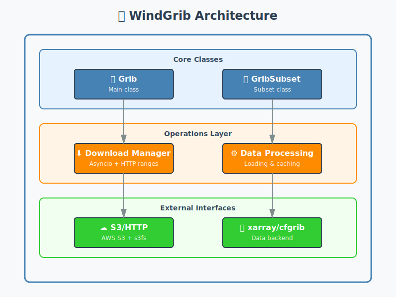

# WindGrib Technical Guide

This technical guide explains the implementation details and advanced usage modes of the WindGrib library.

## Table of Contents

1. [System Architecture](#system-architecture)
2. [Main Classes](#main-classes)
3. [Download Mechanisms](#download-mechanisms)
4. [Subset Management](#subset-management)
5. [Format Conversion](#format-conversion)
6. [xarray Integration](#xarray-integration)
7. [Performance Optimizations](#performance-optimizations)
8. [Extensibility](#extensibility)

## System Architecture

WindGrib follows a modular architecture with the following main components:

<div align="center">



</div>

## Main Classes

### Grib Class

The main class that manages global configuration and high-level operations.

**Main Attributes:**
- `model`: Weather model configuration
- `date`: Data date
- `h`: Data hour
- `data_path`: Data storage path
- `_subsets`: Dictionary of subsets

**Key Methods:**
- `__init__()`: Initialization with configuration
- `download()`: Download all subsets
- `to_netcdf()`: Convert all subsets to NetCDF
- `__getitem__()`: Access subset data

### GribSubset Class

Manages operations specific to a data subset.

**Main Attributes:**
- `name`: Subset name
- `config`: Specific configuration
- `grib`: Reference to parent Grib instance
- `_ds`: Cached xarray dataset

**Key Methods:**
- `download()`: Download files for this subset
- `load_dataset()`: Load dataset
- `to_netcdf()`: Convert to NetCDF
- `messages_df()`: Analyze index files

## Download Mechanisms

### Download Process

1. **File Detection**: Use `s3fs` to list available files
2. **Filtering**: Select relevant files for the subset
3. **Batch Download**: Use `ThreadPoolExecutor` for parallelism
4. **Cache Management**: Check existing files before download
5. **Error Recovery**: Retry mechanism with `max_retry`

### Download Flow Example

[📄 View in source code](../windgrib/grib.py#L420-L450)

```python
# 1. Initialization
grib = Grib(model='ecmwf_ifs')

# 2. Detect available files
grib.latest

# 3. Download subsets
for subset in grib.subsets.values():
    subset.download()

# 4. For each subset:
#    - Check cache
#    - Download missing files
#    - Update index files
```

### HTTP Request Management

The system uses HTTP requests with byte ranges to download only necessary parts of GRIB files:

[📄 View in source code](../windgrib/grib.py#L56-L60)

```python
headers = {'Range': f"bytes={start_byte}-{end_byte}"}
r = get(url, headers=headers, timeout=30)
```

## Subset Management

### Subset Structure

Each model defines its subsets in the `MODELS` configuration:

[📄 View in source code](../windgrib/grib.py#L16-L37)

```python
MODELS = {
    'gfswave': {
        'subsets': {
            'wind': {'variable': ['UGRD', 'VGRD']}
        }
    },
    'ecmwf_ifs': {
        'subsets': {
            'wind': {'param': ['10u', '10v']},
            'land': {'param': ['lsm'], 'step': 0}
        }
    }
}
```

### Subset Access

[📄 View in source code](../windgrib/grib.py#L475-L485)

```python
# Direct access via bracket notation
grib = Grib(model='ecmwf_ifs')
wind_data = grib['wind'].ds  # Returns xarray Dataset

# Access via subset object
wind_subset = grib['wind']
dataset = wind_subset.ds  # Property that loads dataset
```

## Format Conversion

### GRIB → NetCDF Conversion Process

1. **Dataset Loading**: Use `xr.open_dataset()` with cfgrib
2. **Memory Optimization**: Chunked loading
3. **Data Encoding**: Apply optimized encoding
4. **Saving**: Use `to_netcdf()` with compression

### Conversion Example

[📄 View in source code](../windgrib/grib.py#L330-L380)

```python
# Convert specific subset
subset = grib['wind']

# Load dataset with chunking
ds = subset.ds

# Apply encoding
encoding = {
    var: {
        'dtype': 'int16',
        'scale_factor': 0.01,
        '_FillValue': np.iinfo('int16').max,
        'zlib': False
    }
    for var in ds.data_vars
}

# Save as NetCDF
ds.to_netcdf(subset.netcdf_file, encoding=encoding)
```

### NetCDF Format Advantages

- **Faster Reading**: Direct data access without GRIB parsing
- **Compatibility**: Widely supported standard format
- **Reduced Size**: Efficient data compression
- **Preserved Metadata**: Maintains attributes and coordinates

## xarray Integration

### Data Loading

WindGrib uses xarray as the main backend for data processing:

[📄 View in source code](../windgrib/grib.py#L235-L250)

```python
# Loading with cfgrib
ds = xr.open_dataset(
    grib_file,
    engine='cfgrib',
    decode_timedelta=True,
    backend_kwargs={'errors': 'ignore'},
    chunks={'step': 1, 'latitude': -1, 'longitude': -1}
)
```

### Variable Filtering

For models with many variables, filtering is applied:

[📄 View in source code](../windgrib/grib.py#L235-L250)

```python
# Filter by specific key
ds = xr.open_dataset(
    grib_file,
    engine='cfgrib',
    backend_kwargs={
        'filter_by_keys': {'shortName': 'u10'}
    }
)
```

### Dataset Merging

For subsets with multiple variables:

[📄 View in source code](../windgrib/grib.py#L235-L270)

```python
# Merge multiple datasets
datasets = []
for var_name in ['u10', 'v10']:
    ds_var = xr.open_dataset(..., filter_by_keys={'shortName': var_name})
    datasets.append(ds_var)

# Final merge
merged_ds = xr.merge(datasets, compat='override', join='outer')
```

## Performance Optimizations

WindGrib implements several performance optimizations to maximize speed and efficiency. **[See detailed benchmark results](benchmark_results.md)** showing 2.9x faster performance compared to Herbie.

### Asyncio-Based Parallel Downloads

Uses asyncio for concurrent downloads (vs FastHerbie's multi-threading):

[📄 View in source code](../windgrib/grib.py#L580-L610)

```python
executor = ThreadPoolExecutor(max_workers=100)
download_tasks = [executor.submit(self._get_messages, idx_file)
                  for idx_file in idx_files]

# Progress tracking with tqdm
with tqdm(total=len(download_tasks), desc=desc) as progress_bar:
    for _ in as_completed(download_tasks):
        progress_bar.update(1)
```

### Parallel GRIB Decoding

The [`grib_to_dataset`](../windgrib/grib_to_dataset.py#L180-L240) method uses [cfgrib](https://github.com/ecmwf/cfgrib) to decode each GRIB message in an independent process using `ProcessPoolExecutor`. This approach overcomes the multithreading limitations of [eccodes-python](https://github.com/ecmwf/eccodes-python), which doesn't support concurrent access to GRIB messages from multiple threads. By using separate processes instead of threads, WindGrib achieves 2.6x faster GRIB decoding compared to cfgrib's sequential approach:

[📄 View in source code](../windgrib/grib_to_dataset.py#L180-L240)

```python
# grib_to_dataset implementation
from concurrent.futures import ProcessPoolExecutor
import cfgrib

def decode_single_message(message_bytes):
    """Decode a single GRIB message using cfgrib in isolated process."""
    return cfgrib.open_message(message_bytes)

def grib_to_dataset(grib_data, steps=None):
    """Decode GRIB messages in parallel using ProcessPoolExecutor."""
    # Extract individual messages from GRIB data
    messages = extract_messages(grib_data, steps)

    # Decode messages in parallel processes
    with ProcessPoolExecutor() as executor:
        decoded = list(executor.map(decode_single_message, messages))

    # Combine into xarray Dataset
    return combine_to_dataset(decoded)
```

This process-based parallelization is particularly important on Windows, where cfgrib's underlying eccodes library has thread-safety limitations.

### Smart Incremental Caching

Lazy loading with chunking allows loading a dataset without decoding the variable arrays. This enables near-instantaneous determination of available cached steps—the core principle of WindGrib's smart caching system that avoids downloading data already available:

[📄 View in source code](../windgrib/grib.py#L235-L270)

```python
# Open NetCDF with chunking - metadata only, no array decoding
if self.netcdf_file.exists():
    with xr.open_dataset(self.netcdf_file, chunks={'step': 1}) as ds:
        # Instantly get available steps without loading data arrays
        cached_steps = set(ds.step.values)  # Near-instantaneous
        
        # Check if all requested steps are already cached
        if not cached_steps.difference(self.step):
            return  # All data already cached - no download needed

# Determine which steps need to be downloaded
missing_steps = requested_steps - cached_steps

# Only download and decode missing steps from GRIB
if missing_steps:
    new_ds = grib_to_dataset(grib_data, missing_steps)
    # Append to existing cache
    ds = xr.concat([ds, new_ds], dim='step')
    # Save incrementally updated cache
    ds.to_netcdf(self.netcdf_file)
```

This lazy loading approach is fundamental to WindGrib's 6.5x cache speedup, as it avoids both the expensive operation of decoding large data arrays just to check what's already cached and the unnecessary re-downloading of existing data.

## Extensibility

### Adding New Models

To add a new model, simply add it to the `MODELS` configuration:

[📄 View in source code](../windgrib/grib.py#L16-L37)

```python
MODELS = {
    'new_model': {
        'product': 'my_product',
        'url': 'https://my-url.com/',
        'key': '{date}/{h:02d}/my_model/',
        'subsets': {
            'temperature': {'variable': ['TMP']},
            'pressure': {'variable': ['PRMSL']}
        }
    }
}
```

### Custom Subsets

You can create custom subsets:

[📄 View in source code](../windgrib/grib.py#L115-L160)

```python
# Create custom subset
custom_config = {
    'my_subset': {
        'variable': ['VAR1', 'VAR2'],
        'step': 0  # Only first time step
    }
}

# Add to GRIB instance
grib.subsets['my_subset'] = GribSubset(
    'my_subset',
    custom_config['my_subset'],
    grib
)
```

### Extending Functionality

The `GribSubset` class can be extended to add new functionality:

[📄 View in source code](../windgrib/grib.py#L115-L390)

```python
class MyGribSubset(GribSubset):
    def custom_processing(self):
        """Add custom data processing logic"""
        ds = self.ds
        # Custom processing here
        return processed_data
```_method(self):
        # Custom implementation
        ds = self.ds
        # Specific processing
        return result

# Usage
subset = MyGribSubset('name', config, grib_instance)
result = subset.my_new_method()
```

## Development Best Practices

### Memory Management

1. **Always use chunking** for large datasets
2. **Free resources** after use with `ds.close()`
3. **Avoid loading** all time steps into memory

### Download Optimization

1. **Prefer caching** to avoid unnecessary downloads
2. **Use custom paths** to organize data
3. **Limit workers** based on your bandwidth

### Data Validation

1. **Always check** that datasets load correctly
2. **Validate variables** before using them
3. **Handle errors** gracefully

## Conclusion

This technical guide provides a comprehensive overview of WindGrib's architecture and internal mechanisms. For advanced usage or contributing to the project, this deep understanding of components and their interactions is essential.

For more information on the public API and standard usage modes, consult the [Usage Guide](usage_guide.md).
