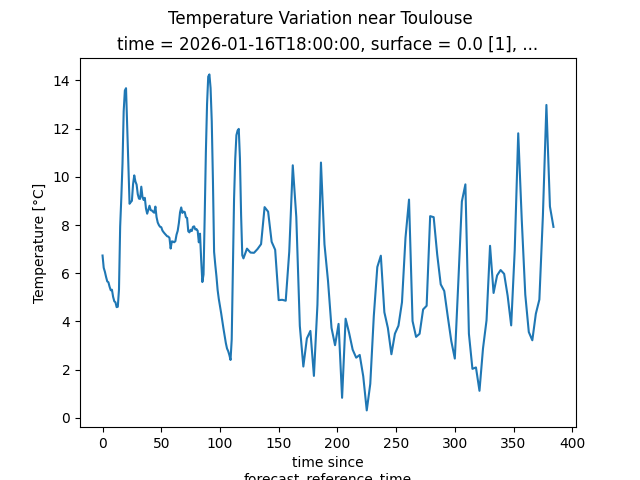

# WindGrib Usage Examples

This section presents concrete examples showing different usage modes of WindGrib. Each example is designed to illustrate a specific aspect of the library.

## Table of Contents

1. [Basic Download and Reading](#basic-download-and-reading)
2. [Data Visualization](#data-visualization)
3. [Model Comparison](#model-comparison)
4. [GFS Atmospheric Temperature](#gfs-atmospheric-temperature)

## Basic Download and Reading

This example shows how to download GRIB data and access it in a basic way.

**Script:** [download_grib.py](../examples/1%23download_grib.py)

**Key Features:**
- Uses caching to avoid redundant downloads
- Converts GRIB to NetCDF for faster subsequent access
- Demonstrates basic data inspection

```python
"""Minimal example of downloading and accessing data,
using cache and saving data to netcdf format to speedup further data reading"""

from windgrib import Grib

if __name__ == '__main__':
    # Create a GRIB instance for the GFS Wave model
    print("\n====Initiating Grib instance and looking for forecast data====")
    gb = Grib(model='ecmwf_ifs')
    # gb = Grib()

    # Download the data
    print("\n====Downloading GFS Wave data...====")
    gb.download(clear_cache=True)
    # clear_cache=False is the default option
    # But you can use clear_cache=True to force downloading ignoring cache files

    # save to grib file for further analysis of downloaded data
    gb.to_grib_file()

    # Access wind data
    wind_data = gb['wind']
    print(f"====Loaded dataset====\n{wind_data}")

    # save to netcdf file to speedup further data reading
    gb.to_netcdf()
```

## Data Visualization

This example shows how to visualize meteorological data using matplotlib.

**Script:** [data_visualization.py](../examples/data_visualization.py)

**Note:** This example demonstrates basic xarray plotting capabilities with matplotlib integration.

```python
"""Example of data visualization with matplotlib using xarray"""
from windgrib import Grib
import numpy as np
import matplotlib.pyplot as plt

if __name__ == '__main__':
    # Load data
    print("Loading data...")
    gb = Grib(model='gfswave')
    gb.download()
    wind_data = gb['wind'].ds

    # Calculate wind speed
    print("Calculating wind speed...")
    wind_speed = 1.94384 * np.sqrt(wind_data.u ** 2 + wind_data.v ** 2)
    wind_speed.attrs['units'] = 'knots'

    # Plot Wind speed - First time step
    wind_speed.isel(step=0).plot(cmap='viridis')
    plt.tight_layout()

    # Save image
    plt.savefig('../docs/images/wind_visualization.png', dpi=300, bbox_inches='tight')
```

### Generated Visualizations


*Wind speed visualization from GFS Wave model*

## Model Comparison

This example shows how to compare data between different weather models (ECMWF vs GFS).

**Script:** [ecmf_gfs_wind_speed_comparison.py](../examples/ecmf_gfs_wind_speed_comparison.py)

**Key Features:**
- Downloads both ECMWF and GFS wind data
- Uses ECMWF land/sea mask (`lsm`) to filter ocean-only data
- Handles coordinate system differences between models
- Finds common forecast times for fair comparison
- Converts wind speeds to knots for maritime applications

```python
"""comparison of wind speed forecast from ECMWF and GFS"""
from matplotlib import pyplot as plt
from windgrib import Grib


def wind_speed(name, u, v):
    """calculate wind speed in knots from u and v components"""
    speed = 1.94384 *  (u ** 2 + v ** 2) ** 0.5
    speed.attrs['units'] = 'knots'
    speed.attrs['long_name'] = f'{name} Wind Speed'
    return speed


if __name__ == '__main__':
    print("\n=== WindGrib Example: GFS/ECMWF Wind Speed Comparison ===")

    print("\n=== GFS ===")
    gfs_gb = Grib()
    # Get wind subset only for current step
    gfs_gbs = gfs_gb['wind'][gfs_gb.current_step]
    gfs_gbs.download()
    gfs_wind = gfs_gbs.ds
    # Convert longitude from (0, 360) to (-180, 180)
    gfs_wind = gfs_wind.assign_coords(longitude=((gfs_wind.longitude + 180) % 360) - 180)
    gfs_wind = gfs_wind.sortby('longitude')

    print("\n=== ECMWF ===")
    ecmwf_gb = Grib(model='ecmwf_ifs')
    # Get wind subset only for current step
    ecmwf_gbs = ecmwf_gb['wind'][ecmwf_gb.current_step]
    ecmwf_gbs.download()
    ecmwf_wind = ecmwf_gbs.ds
    # Apply ocean mask
    ecmwf_gb['land'].download()
    ecmwf_land = ecmwf_gb['land'].ds
    ocean_mask = ecmwf_land.lsm < 0.5
    ecmwf_wind = ecmwf_wind.where(ocean_mask.values)

    print("\n=== Wind Speed Comparison ===")
    # Calculate wind speed and convert m/s to knots
    gfs_wind_speed = wind_speed('GFS', gfs_wind.u, gfs_wind.v)
    ecmwf_wind_speed = wind_speed('ECMWF', ecmwf_wind.u10, ecmwf_wind.v10)

    # Plot comparison
    fig, (ax1, ax2) = plt.subplots(1, 2, figsize=(15, 6))
    gfs_wind_speed.plot(ax=ax1, cmap='viridis', vmin=0, vmax=40)
    ecmwf_wind_speed.plot(ax=ax2, cmap='viridis', vmin=0, vmax=40)
    fig.suptitle(f"GFS and ECMWF wind speed comparison at {gfs_gb.timestamp}")
    plt.tight_layout()
    plt.savefig('../docs/images/wind_speed_comparison.png', dpi=300, bbox_inches='tight')
    print("💾 Wind speed comparison plot saved to wind_speed_comparison.png")
    plt.show()
```

### Generated Visualizations


*ECMWF vs GFS wind speed comparison with ocean masking*

## GFS Atmospheric Temperature

This example shows how to define a custom model for GFS atmospheric temperature data.

**Script:** [temperature_variation_near_toulouse.py](../examples/temperature_variation_near_toulouse.py)

**Key Features:**
- Defines a custom model configuration for GFS atmospheric data
- Downloads surface temperature data (TMP variable)
- Demonstrates spatial interpolation to a specific location
- Shows temperature unit conversion (Kelvin to Celsius)

**Note:** WindGrib downloads global data and cannot subset by geographic region during download. For single-point analysis like this example, downloading the entire global temperature dataset may be suboptimal compared to specialized point-data APIs.

```python
"""  
WindGrib Usage Example: GFS Atmospheric Temperature Data

This example demonstrates how to define a custom model to download
and analyze GFS atmospheric temperature data.
"""

from matplotlib import pyplot as plt
from windgrib.grib import MODELS, Grib

# Configuration for GFS atmospheric with surface temperature subset
MODELS['gfs_atmos_temperature'] = {
    'product': '.pgrb2.0p25',  # start with . to prevent considering goessimpgrb2 product
    'url': 'https://noaa-gfs-bdp-pds.s3.amazonaws.com/',
    'key': 'gfs.{date}/{h:02d}/atmos/',
    'subsets': {
        'temperature': (['TMP'], {'layer': ['surface']})
    },
    'ext': ''
}

if __name__ == '__main__':
    print("=== WindGrib Example: GFS Atmospheric Data ===\n")

    print("1. Downloading latest available GFS atmospheric data...")
    gb = Grib(model='gfs_atmos_temperature')
    gb.download()
    print("Download completed")

    print("\n2. Analyzing temperature data...")
    ds = gb['temperature'].ds
    print(f"Available variables: {list(ds.data_vars)}")
    print(f"Dimensions: {list(ds.dims)}")

    # Convert Kelvin to Celsius and plot temperature variation near Toulouse
    temp_celsius = ds.t - 273.15
    temp_celsius.attrs['units'] = '°C'
    temp_celsius.interp({'latitude': 43.599998, 'longitude': 1.43333}).plot()
    plt.suptitle("Temperature Variation near Toulouse")
    plt.savefig("../docs/images/temperature_variation_near_toulouse.png")
    print("Example completed")
```

### Generated Visualizations


*Temperature variation near Toulouse from GFS atmospheric model*
