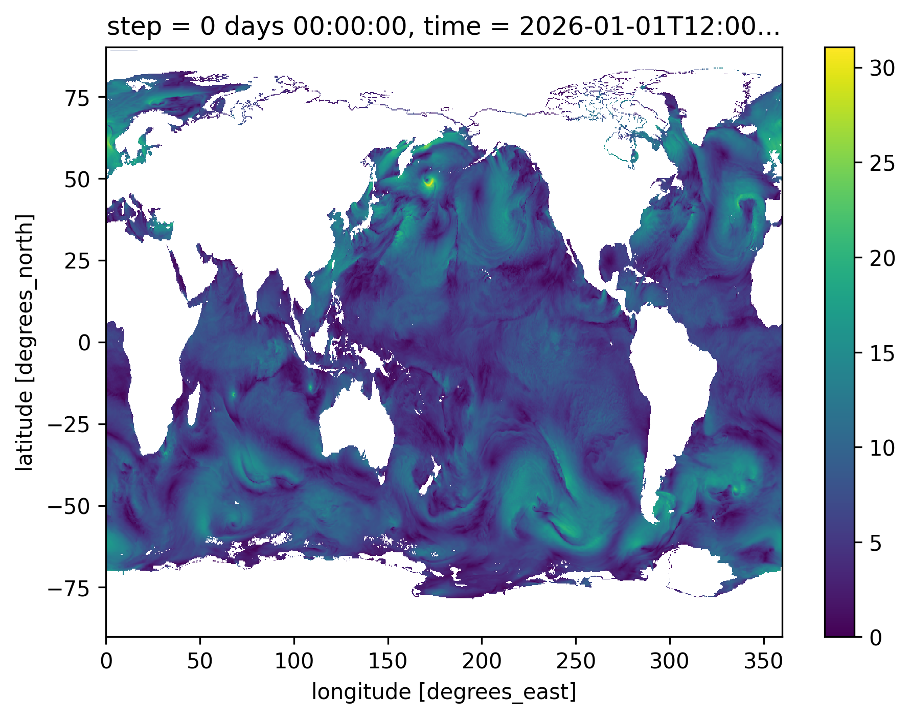
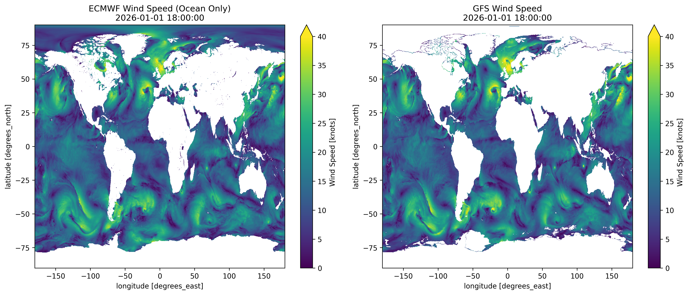

# WindGrib Usage Examples

This section presents concrete examples showing different usage modes of WindGrib. Each example is designed to illustrate a specific aspect of the library.

## Table of Contents

1. [Basic Download and Reading](#basic-download-and-reading)
2. [Download Subset](#download-subset)
3. [Data Visualization](#data-visualization)
4. [Model Comparison](#model-comparison)

## Basic Download and Reading

This example shows how to download GRIB data and access it in a basic way.

**Script:** [download_grib.py](../examples/1%23download_grib.py)

**Key Features:**
- Uses caching to avoid redundant downloads
- Converts GRIB to NetCDF for faster subsequent access
- Demonstrates basic data inspection

```python
"""Minimal example of downloading and accessing data,
using cache and saving data to netcdf format to speedup further data reading"""

from windgrib import Grib

if __name__ == '__main__':
    # Create a GRIB instance for the GFS Wave model
    print("\n====Initiating Grib instance and looking for forecast data====")
    gb = Grib()

    # Download all available data at the latest available forcast date
    print("\n====Downloading GFS Wave data...====")
    gb.download()
    
    # Access the data
    ds = gb['wind'].ds
    print(ds)

    # By default, downloaded data are saved into one consolidated grib2 file
    # But you can save to netcdf file to speedup further data reading
    gb.to_netcdf()


```

## Download Subset

This example shows how to download only specific subsets and forecast steps to minimize data transfer. Different indexing methods can be used depending on the model's step structure.

### GFS Wave Model - Combined Indexing

**Key Features:**
- Uses boolean indexing to filter steps from current time
- Uses slice indexing to select first 10 steps
- Works well when steps are consecutive (1 step per hour)

```python
from windgrib import Grib

if __name__ == '__main__':
    print("\n====Downloading GFS wind subset for limited steps====")
    gb = Grib()
    print(f"Available steps: {gb.step}")
    # GFS wave model delivers one step per hour until step 120 then 1 step every 3 hours until step 384

    # Select wind subset for the next 10 hours from current step
    # (combination of boolean indexing and slice since there is 1 step per hour)
    wind_subset = gb['wind'][gb.step >= gb.current_step][0:10]
    # Download only this subset
    wind_subset.download()

    # Access the downloaded wind data
    wind_data = wind_subset.ds
    print(f"Downloaded steps: {wind_data.step.values}")
    print(f"Variables: {wind_data.data_vars}")
```

### ECMWF IFS Model - Boolean Indexing Only

**Key Features:**
- Uses only boolean indexing for non-consecutive steps
- Filters steps within a time range (current to current + 10 hours)
- Necessary when steps have gaps (e.g., 3-hour or 6-hour intervals)

```python
from windgrib import Grib

if __name__ == '__main__':
    print("\n====Downloading ECMWF wind subset for limited steps====")
    gb = Grib(model='ecmwf_ifs')
    print(f"Available steps: {gb.step}")
    # ECMWF ifs model delivers one step every 3 hours until step 144 then 1 step every 6 hours until step 360

    # Select wind subset for the next 10 hours from current step
    # (using only boolean indexing because there are missing steps)
    valid_steps = (gb.step >= gb.current_step) & (gb.step < gb.current_step + 10)
    wind_subset = gb['wind'][valid_steps]

    # Download only this subset
    wind_subset.download()

    # Access the downloaded wind data
    wind_data = wind_subset.ds
    print(f"Downloaded steps: {wind_data.step.values}")
    print(f"Variables: {wind_data.data_vars}")
```

### Indexing Methods Summary

- **Boolean indexing**: `gb['wind'][gb.step >= gb.current_step]` - filters based on conditions
- **Slice indexing**: `gb['wind'][0:10]` - selects consecutive elements by position
- **Integer indexing**: `gb['wind'][0]` - selects a single step
- **Array indexing**: `gb['wind'][[0, 3, 6]]` - selects specific steps by position
- **Combined**: `gb['wind'][condition][0:10]` - applies multiple filters sequentially

## Data Visualization

This example shows how to visualize meteorological data using matplotlib.

**Script:** [data_visualization.py](../examples/data_visualization.py)

**Note:** This example demonstrates basic xarray plotting capabilities with matplotlib integration.

```python
"""Example of data visualization with matplotlib using xarray"""
from windgrib import Grib
import numpy as np
import matplotlib.pyplot as plt

if __name__ == '__main__':
    # Download the first step of latest available GFS wind data
    print("Loading data...")
    gb = Grib(model='gfswave')
    gbs = gb['wind'][0]
    gbs.download()
    
    # Calculate wind speed
    print("Calculating wind speed...")
    ds = gbs.ds
    wind_speed = 1.94384 * np.sqrt(ds.u ** 2 + ds.v ** 2)
    wind_speed.attrs['units'] = 'knots'

    # Plot Wind speed - First time step
    wind_speed.plot(cmap='viridis')
    plt.tight_layout()

    # Save image
    plt.savefig('../docs/images/wind_visualization.png', dpi=300, bbox_inches='tight')
```

### Generated Visualizations


*Wind speed visualization from GFS Wave model*

## Model Comparison

This example shows how to compare data between different weather models (ECMWF vs GFS).

**Script:** [ecmf_gfs_wind_speed_comparison.py](../examples/ecmf_gfs_wind_speed_comparison.py)

**Key Features:**
- Downloads both ECMWF and GFS wind data
- Uses ECMWF land/sea mask (`lsm`) to filter ocean-only data
- Handles coordinate system differences between models
- Finds common forecast times for fair comparison
- Converts wind speeds to knots for maritime applications

```python
"""comparison of wind speed forecast from ECMWF and GFS"""
from matplotlib import pyplot as plt
from windgrib import Grib


def wind_speed(name, u, v):
    """calculate wind speed in knots from u and v components"""
    speed = 1.94384 *  (u ** 2 + v ** 2) ** 0.5
    speed.attrs['units'] = 'knots'
    speed.attrs['long_name'] = f'{name} Wind Speed'
    return speed


if __name__ == '__main__':
    print("\n=== WindGrib Example: GFS/ECMWF Wind Speed Comparison ===")

    print("\n=== GFS ===")
    gfs_gb = Grib()
    # Get wind subset only for current step
    gfs_gbs = gfs_gb['wind'][gfs_gb.current_step]
    gfs_gbs.download()
    gfs_wind = gfs_gbs.ds
    # Convert longitude from (0, 360) to (-180, 180)
    gfs_wind = gfs_wind.assign_coords(longitude=((gfs_wind.longitude + 180) % 360) - 180)
    gfs_wind = gfs_wind.sortby('longitude')

    print("\n=== ECMWF ===")
    ecmwf_gb = Grib(model='ecmwf_ifs')
    # Get wind subset only for current step
    ecmwf_gbs = ecmwf_gb['wind'][ecmwf_gb.current_step]
    ecmwf_gbs.download()
    ecmwf_wind = ecmwf_gbs.ds
    # Apply ocean mask
    ecmwf_gb['land'].download()
    ecmwf_land = ecmwf_gb['land'].ds
    ocean_mask = ecmwf_land.lsm < 0.5
    ecmwf_wind = ecmwf_wind.where(ocean_mask.values)

    print("\n=== Wind Speed Comparison ===")
    # Calculate wind speed and convert m/s to knots
    gfs_wind_speed = wind_speed('GFS', gfs_wind.u, gfs_wind.v)
    ecmwf_wind_speed = wind_speed('ECMWF', ecmwf_wind.u10, ecmwf_wind.v10)

    # Plot comparison
    fig, (ax1, ax2) = plt.subplots(1, 2, figsize=(15, 6))
    gfs_wind_speed.plot(ax=ax1, cmap='viridis', vmin=0, vmax=40)
    ecmwf_wind_speed.plot(ax=ax2, cmap='viridis', vmin=0, vmax=40)
    fig.suptitle(f"GFS and ECMWF wind speed comparison at {gfs_gb.timestamp}")
    plt.tight_layout()
    plt.savefig('../docs/images/wind_speed_comparison.png', dpi=300, bbox_inches='tight')
    plt.show()
```

### Generated Visualizations


*ECMWF vs GFS wind speed comparison with ocean masking*
